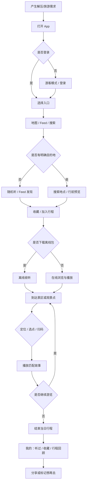

# 流光幻旅 · 产品需求文档（PRD）

| 项目 | 内容 |
|------|------|
| 产品名称 | 流光幻旅 |
| 文档版本 | V1.0 |
| 文档状态 | 草案 |
| 目标用户 | 压力大的上班族，以旅游作为心灵解压方式 |
| 产品定位 | 基于地理位置触发的沉浸式目的地故事体验 App |

---

## 一、项目背景

国内休闲旅游与短途出行持续增长，用户不再满足于「打卡拍照」，更希望在旅途中获得**情绪价值**与**意义感**。无论是自然风景还是历史名胜古迹，背后往往都有可讲述的叙事——形成原因、演变过程、经典典故等。旅游不仅是「用眼睛看」，也是一次心灵的洗涤；若能在所见之景上叠加对其故事的理解，体验会从表面观感升级为更深层的共鸣。

然而，这类信息目前分散在书籍、纪录片、导游讲解、碎片化网文等渠道中：**行前**难以系统获取，**行中**难以与当下站位即时匹配，**行后**难以与个人回忆沉淀绑定。用户（尤其是压力大的上班族）在有限假期里，眼睛看到了风景，却常因缺乏背景故事的了解，感受停留在表面，难以获得预期的「心灵解放」效果。

因此，需要一款以**「目的地故事」**为核心的产品，在旅行前、中、后合适场景下，把「看见」升级为「读懂」，服务以解压、疗愈为动机的出行人群。

---

## 二、核心目标

| 目标类型 | 说明 |
|----------|------|
| **认知目标** | 让用户在旅游前、中、后，能便捷获取与当前目的地/点位相关的背景故事（成因、过程、典故等），降低信息搜寻成本。 |
| **体验目标** | 将故事与地理位置、游览动线结合，形成「景—事—情」的连贯体验，增强心灵层面的满足感，而非仅视觉刺激。 |
| **商业与增长目标** | 建立可持续的内容供给与分发机制，通过会员、深度内容、合作景区等路径验证商业模式（指标在 MVP 阶段可后续量化）。 |

**一句话价值主张：** 把「看见景点」升级为「读懂世界」，提供情绪价值驱动的旅行体验。

---

## 三、痛点分析

| 痛点 | 用户表现 | 业务/体验影响 |
|------|----------|----------------|
| **故事与现场脱节** | 到了景点不知道看什么、为什么值得看 | 感受停留在表面，难以产生深层共鸣与疗愈感 |
| **信息获取成本高** | 需自行搜索、筛选真伪、拼凑碎片信息 | 行前准备累，行中频繁打断游览节奏 |
| **场景不匹配** | 通用攻略多，与当下站位、游览路线无关 | 无法「当下解惑」，现场获得感弱 |
| **记忆难沉淀** | 游后只剩照片，故事未与个人体验绑定 | 难以复盘情绪价值，复访与分享动力不足 |

**核心痛点总结：** 眼睛所看到的风景，缺乏背景故事的了解，所有风景带来的感受都只停留于表面。

---

## 四、可行性分析

### 4.1 需求可行性

「解压式旅游」「深度体验」「文化消费」与目标用户画像（压力大、需靠旅游解放心灵的上班族）高度一致；痛点可通过用户访谈、问卷及 MVP 行为数据（完播率、连续播放率等）验证。

### 4.2 技术可行性

LBS、地图、音频播放、图文内容管理、搜索与推荐均为成熟能力；主要技术难点在于**内容质量**与**定位精度**，可通过内容分层运营、离线包、手动选点/扫码等方案兜底。

### 4.3 内容可行性

冷启动可依托：公版史料、合作景区官方讲解词、签约作者/主播供稿；需配套事实核查、版权管理与内容更新机制。产品规划中已包含 AI 辅助结构化提取与故事化改写（详见《旅行故事APP需求说明书》AI 能力章节）。

### 4.4 商业可行性

会员订阅、单点付费深度故事包、B 端景区/文旅合作均为行业常见路径；MVP 阶段建议优先验证：**播放点击率、完播率、停留时长、连续播放率**。

### 4.5 风险与应对

| 风险 | 应对策略 |
|------|----------|
| 内容同质化 | 强化钩子文案、情绪标签与专题差异化 |
| 版权纠纷 | CMS 信源标注、审核流、用户纠错机制 |
| 定位误差/弱网 | 离线包下载、手动选点、扫码触发 |
| MVP 范围膨胀 | 优先单城市/核心景区，C 端游客为主角色 |

---

## 五、产品定位与目标用户

### 5.1 产品定位

- **品类：** 基于地理位置触发的沉浸式故事体验 App  
- **核心价值：** 景—事—情连贯；情绪价值驱动的旅行体验  

### 5.2 目标用户（C 端）

| 用户类型 | 特征 | 核心需求 |
|----------|------|----------|
| **城市白领（核心）** | 压力大、短途出行频繁 | 放松、疗愈、低负担获取故事 |
| **深度旅行者** | 不满足打卡式游览 | 文化背景、高质量叙事 |
| **内容消费用户** | 播客/纪录片爱好者 | 碎片化收听、随机发现 |

---

## 六、用户角色

| 角色 | 说明 | MVP 阶段 |
|------|------|----------|
| **游客** | 压力大、追求心灵放松的上班族；行前决策与行中体验主力 | ✅ 核心实现 |
| **同行亲友** | 共用行程，可能共用设备或分享内容链接 | 预留分享能力 |
| **内容消费者（旁听）** | 仅收听音频、少互动；车载/耳机场景 | ✅ 播放器优化 |
| **内容创作者/供稿方** | 撰写或录制故事脚本（内部编辑或签约作者） | 后台/CMS |
| **内容审核/运营** | 把控事实、版权与上下架 | 后台审核流 |
| **景区/文旅合作方（B 端）** | 提供官方讲解素材、点位授权 | 阶段后置 |
| **平台管理员** | 类目、推荐策略、风控与数据看板 | 后台基础能力 |

> **说明：** MVP 以 C 端「游客」为主角色，其余角色在功能清单与后台模块中预留，不要求首期全部上线。

---

## 七、核心用户场景

### 7.1 场景总览

| 阶段 | 场景编号 | 场景描述 | 用户目标 |
|------|----------|----------|----------|
| 行前 | S1 | 无明确目的地，通过故事类型/随机听发现想去的地方 | 降低决策成本，建立情绪预期 |
| 行前 | S2 | 已有明确目的地，浏览该地故事与景点价值 | 判断「值不值得去」、规划兴趣点 |
| 行前 | S3 | 下载离线包，弱网环境下仍可收听 | 保障行中体验稳定 |
| 行中 | S4 | 到达观景点，基于定位/选点/扫码获取匹配故事 | 当下解惑，读懂眼前之景 |
| 行中 | S5 | 沿游览动线移动，故事随点位切换 | 连续叙事，沉浸游览 |
| 行中 | S6 | 乘车、排队等碎片时间纯音频收听 | 不盯屏、不打断节奏 |
| 行中 | S7 | 重新查看/调整行程与附近故事点 | 灵活规划当日动线 |
| 行后 | S8 | 回顾听过的故事与时间线，记录心情 | 沉淀情绪价值 |
| 行后 | S9 | 生成分享内容作为轻量攻略 | 社交传播与回流 |
| 全周期 | S10 | 仅想听故事、无旅行计划（Feed/随机听） | 内容消费与收藏 |
| 全周期 | S11 | 对某一典故延伸了解，跳转专题或关联景点 | 深度阅读 |

### 7.2 典型操作路径（与原型对齐）

**路径 A · 无目的地探索**  
打开 App → 故事 Feed / 随机听 → 发现感兴趣 → 收藏或加入行程 → 行前预览该城市故事地图

**路径 B · 有明确目的地**  
打开 App → 搜索地点 → 浏览故事清单 → 加入行程 → 行前预览 → 到达景区

**路径 C · 行中现场**  
打开 App → 自动定位 / 地图选点 → 展示故事卡片 → 进入播放页沉浸收听 → 推荐下一个故事

**路径 D · 纯内容消费**  
打开 App → 搜索或随机听 → 收藏 →（可选）暂不登录浏览

---

## 八、用户主流程图

### 8.1 端到端主路径



### 8.2 行中收听子流程


---

## 九、功能架构与功能清单

### 9.1 功能范围（MVP 对照）

| 模块 | 是否纳入 MVP | 备注 |
|------|:------------:|------|
| 登录/注册 | ✅ | 手机号、微信；支持游客浏览 |
| 地图 + 定位 | ✅ | 故事点位、附近推荐、搜索 |
| 故事播放 | ✅ | 核心沉浸体验 |
| 故事流（Feed） | ✅ | 卡片流 + 随机听 |
| 行前预览 | ✅ | 城市故事地图预览 |
| 行程规划（轻量） | ✅ | 加入行程 + AI 漫步路线 |
| 用户记录 | ✅ | 听过、收藏 |
| AI 生成故事 | ✅ | 内容生产链路 |
| 离线包 | 二期 | PRD 全量规划保留 |
| 社区/UGC | ❌ | 后续版本 |
| 会员付费 | 二期 | 权益配置预留 |

### 9.2 功能清单（模块—功能—描述）

| 模块名称 | 功能名称 | 功能描述 |
|----------|----------|----------|
| **账号与访问** | 注册登录 | 支持手机号验证码、微信登录；协议与隐私政策确认。 |
| **账号与访问** | 游客模式 | 「暂不登录，随便看看」降低首次使用门槛。 |
| **账号与访问** | 个人中心 | 头像、昵称、听过的/收藏/行程入口聚合（「我的」Tab）。 |
| **目的地与内容发现** | 目的地检索 | 按城市、景区、关键词搜索地点或故事。 |
| **目的地与内容发现** | 故事 Feed | 故事卡片流：封面、标题、钩子、情绪标签、播放入口；支持城市标签筛选。 |
| **目的地与内容发现** | 随机听 | 一键随机播放一段故事，服务无目的地探索场景（S1、S10）。 |
| **目的地与内容发现** | 推荐逻辑 | 结合播放量、完播率、用户偏好进行排序（MVP 可简化规则）。 |
| **目的地与内容发现** | 主题/专题聚合 | 按地质、历史、传说等专题聚合内容（可二期深化）。 |
| **行前模块** | 城市故事预览 | 一句话总结、点位分布、故事数量、情绪分布、精选故事、「开始探索」入口。 |
| **行程与规划** | 加入行程 | 播放页/地图卡片一键将故事对应景点加入行程。 |
| **行程与规划** | 行程列表 | 「我的」展示已加入景点的故事卡片，支持播放。 |
| **行程与规划** | AI 故事漫步路线 | 根据行程点物理距离生成推荐游览顺序与预估时间。 |
| **行程与规划** | 行程地图可视化 | 行程点在地图上的距离与连线展示。 |
| **行程与离线** | 离线包下载与管理 | 选中故事/路线打包下载，展示占用与更新（二期）。 |
| **现场体验·地图** | 用户定位 | 自动定位当前位置，支持用户修正定位。 |
| **现场体验·地图** | 故事点位展示 | 地图上展示可点击的故事锚点。 |
| **现场体验·地图** | 附近故事卡片 | 进入点位范围（如 200m）底部静默展示故事卡片，点击进播放页。 |
| **现场体验·地图** | 地址搜索 | 搜索地点并跳转对应故事区域。 |
| **现场体验·播放** | 沉浸式播放页 | 背景视觉、标题、钩子、情绪标签、进度条（含剩余时间）、倍速（0.5x–2x）。 |
| **现场体验·播放** | 断点续播 | 记录播放进度，再次打开可续听。 |
| **现场体验·播放** | 下一个推荐 | 展示下一个故事推荐，**不自动播放**，由用户选择。 |
| **现场体验·播放** | 信源说明 | 播放页底部展示内容参考来源。 |
| **现场体验·播放** | 内容纠错 | 用户反馈事实错误入口。 |
| **现场体验·播放** | 背景音控制 | 氛围音与故事内容匹配（按资源能力分期）。 |
| **行后沉淀** | 听过的故事 | 按时间记录播放历史，支持再次播放。 |
| **行后沉淀** | 收藏 | 故事收藏列表，与 Feed/地图/播放页联动。 |
| **行后沉淀** | 游记时间线 | 按日期与地点聚合听过内容与笔记（可二期）。 |
| **行后沉淀** | 分享导出 | 生成分享图/短文案，链接回流 App 或 H5（可二期）。 |
| **账号与会员** | 会员与权益 | 高清离线、独家专题等（二期）。 |
| **内容管理后台** | 故事与点位 CMS | 录入标题、摘要、正文/音频、地理围栏、标签、封面与钩子。 |
| **内容管理后台** | 审核与版本 | 审核流、上下架、修订记录与事实备注。 |
| **内容管理后台** | 数据统计 | 播放量、完播率、热门目的地与转化漏斗。 |
| **AI 内容生产** | 结构化提取 | 从维基/史料/地理资料提取关键事实。 |
| **AI 内容生产** | 故事化改写 | 生成 1–3 分钟音频脚本，含冲突/悬念钩子。 |
| **AI 内容生产** | 语音合成 | AI 语音讲述，支持连续收听体验。 |
| **系统与合规** | 隐私与权限 | 位置、存储等权限说明与最小化采集。 |
| **系统与合规** | 版权与来源标注 | 内容来源字段，面向用户展示信源。 |

### 9.3 信息架构（与原型一致）

```
底部导航
├── 地图（首页）
│   ├── 搜索地点/故事
│   ├── 故事点位 + 附近推荐
│   └── 故事卡片 → 播放页
├── 故事（Feed）
│   ├── 城市标签
│   ├── 随机听
│   └── 故事卡片流 → 播放页
└── 我的
    ├── 行程规划（含 AI 漫步路线）
    ├── 听过的
    └── 收藏

全局浮层：登录页 | 播放全屏 | 行前预览 Sheet
```

---

## 十、核心指标（MVP）

| 指标 | 含义 | 用途 |
|------|------|------|
| 播放点击率 | 卡片/点位曝光后的播放转化 | 验证钩子与封面吸引力 |
| 完播率 | 单次故事收听完成比例 | 验证内容质量 |
| 停留时长 | 单次会话使用时长 | 验证沉浸程度 |
| 连续播放率 | 播放结束后点击「下一个」的比例 | 验证产品粘性 |
| 加入行程率 | 播放页「加入行程」点击 | 验证行前/行中规划价值 |

---

## 十一、附录

| 文档 | 说明 |
|------|------|
| 《旅行故事APP需求说明书》 | 交互细节、Feed/播放/地图字段规范、AI 流程 |
| 原型 `index.html` | 流光幻旅高保真可交互原型 |

### 修订记录

| 版本 | 日期 | 修订内容 | 作者 |
|------|------|----------|------|
| V1.0 | 2026-05-26 | 整合项目背景、目标、痛点、可行性、场景、角色、流程图、功能清单 | — |
